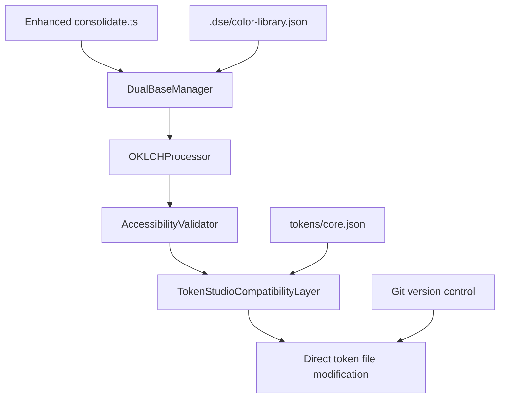

# OKLCH Color System Optimization - Brownfield Enhancement Architecture

## Introduction

This document outlines the architectural approach for enhancing the Design System with **OKLCH-based mathematical color consistency** using a hybrid dual-base approach. Its primary goal is to serve as the guiding architectural blueprint for implementing scientifically accurate color optimization while preserving all existing colors and maintaining Token Studio compatibility.

**Enhancement Description:** OKLCH Color System Optimization - Converting ~350+ existing colors to mathematically consistent OKLCH values using Cool Neutral (neutrals) and Amber (brand colors) as base colors.

**Relationship to Existing Architecture:**
This document supplements existing design system architecture by defining how OKLCH color science will be integrated into current token workflows. The enhancement preserves existing Token Studio compatibility while adding mathematical consistency and accessibility compliance.

## Existing Project Analysis

### Current Project State

**Primary Purpose:** Multi-brand design system supporting Base, Logifuture, and Bet9ja brands through Token Studio integration and automated token pipeline workflows.

**Current Tech Stack:** TypeScript, Node.js, JSON-based token storage, Token Studio plugin compatibility, automated consolidate/split scripts

**Architecture Style:** File-based token architecture with .dse/ enhancement layer, mirror Token Studio format in tokens/ directory, and consolidated output via tokensource.json

**Deployment Method:** Node.js script-based pipeline with npm commands, file system operations, and Token Studio plugin integration

### Available Documentation

Based on analysis, existing documentation includes:
- Token structure documentation (implicit in file organization)
- DSE configuration system (.dse/README.md)
- Color library configuration (.dse/color-library.json)
- Script-based workflow documentation (package.json commands)
- Epic 4 OKLCH completion context in .dse/memory/

### Identified Constraints

- **Token Studio Compatibility:** Must maintain exact file structure and naming conventions for Figma plugin compatibility
- **Multi-Brand Support:** Changes must preserve brand differentiation across Base, Logifuture, and Bet9ja color systems
- **Existing Color Investment:** ~350+ colors represent significant design investment that must be preserved visually
- **Pipeline Performance:** Build scripts must maintain acceptable performance with mathematical processing additions
- **Designer Workflow:** Zero disruption to existing Token Studio workflow and designer experience
- **Accessibility Compliance:** Current accessibility levels must be maintained or improved, not degraded

### Change Log
| Change | Date | Version | Description | Author |
|--------|------|---------|-------------|--------|
| Initial Architecture | 2025-01-16 | 1.0 | OKLCH optimization architecture creation | BMad Master |

## Enhancement Scope and Integration Strategy

### Enhancement Overview

**Enhancement Type:** Mathematical Color System Optimization with Scientific Foundation  
**Scope:** Comprehensive OKLCH conversion of all ~350+ color tokens using hybrid dual-base approach while preserving visual brand characteristics and Token Studio workflow integrity  
**Integration Impact:** Moderate - Mathematical optimization layer added to existing pipeline without structural changes

### Integration Approach

**Code Integration Strategy:** 
Enhance existing .dse/ architecture with OKLCH processing modules that integrate seamlessly with current consolidate/split workflows. OKLCH utilities will be added as enhancement layer while preserving all existing interfaces and Token Studio mirror structure.

**Database Integration:** 
Direct modification of existing JSON token files (core.json, global.json, brand files) using atomic write operations. Maintain identical file structure and naming conventions while updating color values in-place using Git for version control.

**API Integration:** 
Enhance existing script interfaces (consolidate.ts, split.ts) with OKLCH processing capabilities while maintaining identical input/output contracts. All existing npm commands and pipeline integrations continue functioning without modification.

**UI Integration:** 
Zero impact on Token Studio designer experience - optimized colors maintain HEX output format and identical token structure. Figma plugin integration preserved through unchanged file organization and semantic token mappings.

### Compatibility Requirements

**Existing API Compatibility:** All script interfaces, npm commands, and pipeline automation continue functioning identically with OKLCH-optimized colors

**Database Schema Compatibility:** Complete preservation of JSON token structure, naming conventions, and file organization for seamless Token Studio integration

**UI/UX Consistency:** Visual appearance maintained within imperceptible tolerance (Delta E < 2.0) to preserve brand characteristics and designer expectations

**Performance Impact:** Processing time increase limited to maximum 50% of current pipeline execution time to maintain acceptable build performance

## Tech Stack Alignment

### Existing Technology Stack

| Category | Current Technology | Version | Usage in Enhancement | Notes |
|----------|-------------------|---------|---------------------|-------|
| **Runtime** | Node.js | Latest LTS | OKLCH processing scripts | Maintain existing version compatibility |
| **Language** | TypeScript | 4.x+ | New OKLCH utilities and type definitions | Follow existing strict mode patterns |
| **Build Tools** | npm scripts | Latest | Enhanced consolidate/split workflows | Preserve all existing commands |
| **Token Format** | JSON | Standard | Token file structure preservation | Zero format changes |
| **Color Library** | Existing HEX values | N/A | OKLCH mathematical optimization | Converted to OKLCH, output as HEX |
| **Integration** | Token Studio Plugin | Latest | Figma workflow compatibility | Critical compatibility requirement |
| **File System** | Node.js fs operations | Built-in | Direct file modification with Git backup | Enhanced with OKLCH processing |
| **Configuration** | .dse/ JSON configs | Custom | Extended with dual-base parameters | Backward compatible enhancement |

### New Technology Additions

| Technology | Version | Purpose | Rationale | Integration Method |
|------------|---------|---------|-----------|-------------------|
| **culori** | ^3.0.0 | OKLCH color space processing | Industry-standard OKLCH library with high precision | npm dependency, integrate with existing .dse/ modules |
| **Delta E calculation** | via culori | Visual fidelity validation | Ensure imperceptible color changes (< 2.0) | Built into color conversion validation |
| **Mathematical utilities** | Custom TypeScript | OKLCH stepping algorithms | Dual-base mathematical consistency | New .dse/oklch/ utility modules |

## Data Models and Schema Changes

### Enhanced Token Structure

**OKLCH Metadata Enhancement:** 
Existing token files enhanced with OKLCH-derived values while preserving Token Studio format:

```json
{
  "Amber 500": {
    "$type": "color",
    "$value": "#ffd14c",
    "$description": "Primary CTA default (OKLCH optimized)"
  }
}
```

**Dual Base Configuration:** 
Enhanced .dse/color-library.json with hybrid base approach parameters:

```json
{
  "colorLibrary": {
    "dualBaseApproach": {
      "coolNeutralBase": {
        "hex": "#35383d",
        "oklch": {"l": 0.25, "c": 0.025, "h": 230},
        "role": "neutral_foundation"
      },
      "amberBase": {
        "hex": "#ffd24d", 
        "oklch": {"l": 0.85, "c": 0.15, "h": 90},
        "role": "brand_foundation"
      }
    }
  }
}
```

### Schema Integration Strategy

**Direct File Modification:** 
Existing core.json, global.json, and brand token files modified directly with OKLCH-optimized HEX values. Git version control provides rollback capability.

**Backward Compatibility:** 
All existing token consumption continues functioning identically - only color values change (imperceptibly), structure remains unchanged.

## Component Architecture

### New OKLCH Components

#### OKLCHProcessor
**Responsibility:** Core OKLCH color space conversion and mathematical consistency algorithms  
**Integration:** Enhances existing consolidate.ts workflow with mathematical optimization  
**Key Interfaces:** convertToOKLCH(), optimizeColorFamily(), validateDeltaE()

#### DualBaseManager
**Responsibility:** Manage Cool Neutral and Amber base color mathematics  
**Integration:** Central coordination for base color selection and mathematical relationships  
**Key Interfaces:** getCoolNeutralBase(), getAmberBase(), selectBaseForFamily()

#### AccessibilityValidator
**Responsibility:** WCAG compliance validation for OKLCH-optimized colors  
**Integration:** Enhances existing validation with accessibility compliance checking  
**Key Interfaces:** validateWCAG(), calculateContrastRatio(), ensureAccessibilityPreservation()

#### TokenStudioCompatibilityLayer
**Responsibility:** Ensure seamless Token Studio integration during optimization  
**Integration:** Preserves exact file format and plugin compatibility  
**Key Interfaces:** preserveTokenStructure(), validatePluginCompatibility()

### Component Interaction



## Source Tree Integration

### Enhanced Project Structure

```
Design System V2/
├── .dse/                           # Enhanced DSE architecture
│   ├── oklch/                      # New OKLCH processing modules
│   │   ├── processor.ts            # Core OKLCH conversion utilities
│   │   ├── dual-base-manager.ts    # Base color mathematics
│   │   ├── accessibility-validator.ts # Enhanced WCAG validation
│   │   └── compatibility-layer.ts  # Token Studio integration
│   ├── color-library.json          # Enhanced with dual-base config
│   └── existing files...           # Preserved unchanged
├── tokens/                         # Direct modification approach
│   ├── core.json                   # OKLCH-optimized values, same structure
│   └── [other token files]         # Optimized values, same structure
├── scripts/                        # Enhanced pipeline automation
│   ├── consolidate.ts              # Enhanced with OKLCH processing
│   └── split.ts                    # Enhanced with OKLCH validation
└── docs/                           # Enhanced documentation
    ├── oklch-color-optimization-prd.md
    └── oklch-color-architecture.md
```

### Integration Guidelines

**File Modification:** Direct enhancement of existing files rather than duplication
**Git Management:** Single baseline commit for rollback, single optimization commit for deployment
**Import Patterns:** New OKLCH modules follow existing .dse/ barrel export patterns

## Infrastructure and Deployment Integration

### Git-Based Deployment Strategy

**Pre-OKLCH Baseline:** 
Single commit with current state labeled "Pre-OKLCH baseline - revert point if needed"

**OKLCH Implementation:** 
Single atomic commit containing all OKLCH optimizations with clear commit message

**Rollback Strategy:** 
Simple Git revert of optimization commit if issues arise - clean, reliable, leveraging existing version control

### Infrastructure Changes

**Minimal Dependencies:** Add culori to package.json
**Enhanced Scripts:** Direct modification of existing consolidate.ts/split.ts
**Configuration Update:** Enhanced .dse/color-library.json with dual-base parameters
**No Infrastructure Changes:** Leverages existing Node.js/npm/Git workflow

## Coding Standards and Conventions

### Existing Standards Compliance

**Code Style:** TypeScript strict mode following existing .dse/ module patterns
**Testing Patterns:** Enhanced existing validation with OKLCH mathematical verification
**Documentation Style:** Extended JSDoc with OKLCH mathematical formula documentation

### Enhancement-Specific Standards

- **OKLCH Mathematical Precision:** Lightness ±0.001, chroma/hue ±0.0001
- **Delta E Validation:** Every conversion must validate Delta E < 2.0
- **Accessibility Documentation:** WCAG compliance levels in code comments
- **Base Color Attribution:** Document which base (Cool Neutral/Amber) was used

### Critical Integration Rules

**API Compatibility:** Enhanced scripts maintain identical interfaces
**File Format Preservation:** Direct JSON modification preserves Token Studio schema
**Error Handling:** OKLCH processing failures fall back to original values
**Logging Consistency:** Enhanced output follows existing patterns

## Testing Strategy

### Integration with Existing Tests

**Enhanced Validation:** Extend current .dse/ validation with OKLCH mathematical verification
**Coverage Requirements:** 100% coverage for mathematical functions and Delta E calculations
**Regression Testing:** Comprehensive validation that optimized colors maintain all existing functionality

### New Testing Requirements

**Unit Tests:** Mathematical accuracy, Delta E validation, base color algorithms
**Integration Tests:** Complete workflow testing from consolidate → OKLCH → Token Studio compatibility
**Regression Tests:** Verify existing functionality unchanged with optimized colors

## Security Integration

### Existing Security Measures

**File System Security:** Standard Node.js file operation permissions
**Dependency Security:** npm audit for package vulnerability scanning

### Enhancement Security Requirements

**Dependency Validation:** Security assessment for culori library addition
**Input Validation:** OKLCH mathematical function robustness (prevent invalid values)
**File Operation Security:** Atomic writes during direct token modification

## Next Steps

### Story Manager Handoff

**Reference Documentation:** 
- OKLCH Color Optimization PRD (docs/oklch-color-optimization-prd.md)
- OKLCH Color Architecture (this document)

**First Story Implementation:**
Story 1.1: OKLCH Foundation and Dual-Base Analysis
- Establish Cool Neutral 300 and Amber 500 OKLCH base values
- Create mathematical stepping algorithms
- Validate foundation without modifying existing token files

### Developer Handoff

**Implementation Approach:** 
- Direct modification of existing token files with OKLCH-optimized values
- Enhance existing scripts rather than creating parallel systems
- Git-based version control for deployment and rollback

**Technical Requirements:**
- Hybrid dual-base approach using Cool Neutral (neutrals) and Amber (brand colors)
- culori library integration for OKLCH processing
- Mathematical precision: lightness ±0.001, chroma/hue ±0.0001
- Delta E < 2.0 validation for imperceptible changes

**System Integrity:**
- Preserve Token Studio compatibility through unchanged file structure
- Maintain existing npm script interfaces
- Ensure continuous designer workflow functionality

---

**Document Status:** Complete  
**Implementation Ready:** Yes - Foundation established for Story 1.1 execution  
**Architectural Validation:** Complete with brownfield-specific integration requirements